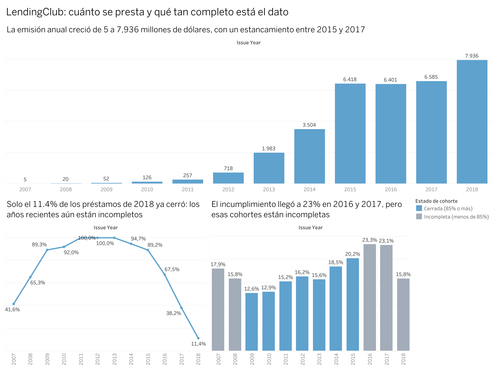
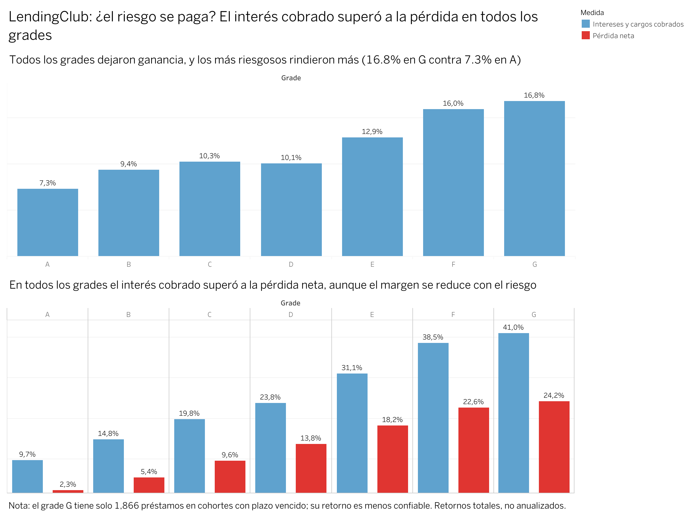
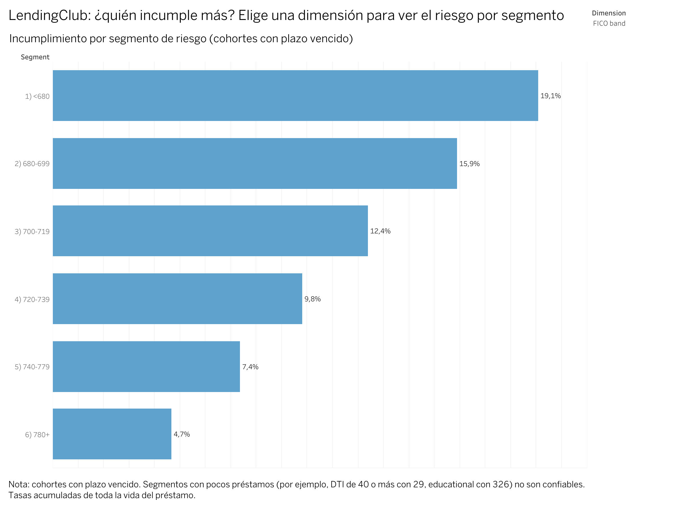

# LendingClub · Análisis de riesgo de crédito y cobranza

🌎 [Read in English](README.md)

**Herramientas:** PostgreSQL · SQL · Python · Git y GitHub · Tableau Public
**Datos:** [Préstamos aprobados de LendingClub, 2007–2018 (Kaggle)](https://www.kaggle.com/datasets/wordsforthewise/lending-club) · 1,345,350 préstamos cerrados · dólares (USD)

## 🎯 Mensaje principal

> **En todos los grades, LendingClub cobró más interés del que perdió. Pero a mayor riesgo, el interés cubre la pérdida menos veces (de 4.1 en el grade A a cerca de 1.7 de D a G), y cuando un préstamo falla solo se recupera cerca del 13% del capital no pagado, sea cual sea el grade.**

## 📊 Dashboard

👉 **[Abrir el dashboard interactivo en Tableau Public](https://public.tableau.com/views/LendingClubCreditRiskCollectionsRiesgodecrditoycobranza/1Howmuchislent)** (3 páginas en inglés y 3 en español)





## ❓ Preguntas del negocio

Es un caso de negocio simulado. Las preguntas las definí yo, a partir de los datos disponibles:

1. ¿Cuánto se presta y cómo evoluciona?
2. ¿Qué proporción de los préstamos no se paga?
3. ¿Qué perfiles de cliente y qué tipos de préstamo son más riesgosos?
4. ¿Cuánto se recupera de lo que no se pagó?

## 🔎 Hallazgos principales

- **La emisión creció de 5 a 7,936 millones de dólares** entre 2007 y 2018, pero los años recientes están incompletos: de lo emitido en 2018, solo el 11.4% ya cerró.
- **El riesgo crece más rápido que el precio.** Del grade A al G, el incumplimiento sube unas 6.8 veces y la tasa de interés unas 3.4 veces.
- **Todos los grades dejaron ganancia**, y los más riesgosos dejaron más, pero con menos colchón.
- **La cobranza recupera poco**: cerca del 13% del capital no pagado, casi igual en todos los grades.
- **Los clientes con peor puntaje FICO o con más deuda respecto a su ingreso incumplen más.** Los clientes verificados también incumplen más, y lo más probable es que refleje a quién se verifica y no un efecto de la verificación.

El análisis completo, con tablas y cada supuesto, está en el resumen ejecutivo: [Español](docs/resumen_ejecutivo_ES.md) · [English](docs/executive_summary_EN.md).

## ✅ Recomendaciones

Dos ideas para **probar**, no conclusiones definitivas:

1. **Evaluar si la tasa de interés debería tomar más en cuenta la deuda sobre ingreso (DTI)**, o limitar de forma experimental los préstamos a clientes con DTI de 30% o más. Impacto estimado: unos 4.1 millones de dólares sobre cohortes históricas.
2. **Probar una cobranza más temprana y diferenciada por segmento**, en un piloto. Impacto estimado: unos 9.6 millones de dólares si la recuperación subiera de 12.8% a 14%.

Las estimaciones son acumuladas, no anuales, y no descuentan el costo de las acciones.

## 🛠️ Proceso

| Fase | Qué hice |
|---|---|
| 0 | Preparé el entorno: Linux en Windows (WSL), Git, PostgreSQL y GitHub CLI |
| 1 | Descargué y conocí los datos, y decidí qué préstamos y columnas conservar |
| 2 | Cargué a PostgreSQL como texto y luego limpié y asigné tipos con SQL |
| 3 | Análisis exploratorio con SQL |
| 4 | Métricas de riesgo, pérdida, recuperación y retorno; tablas para Tableau |
| 5 | Construí y publiqué los dashboards en Tableau Public (inglés y español) |
| 6 | Redacté el resumen ejecutivo y las recomendaciones |

Tableau Public no se conecta a bases de datos, así que el flujo es: **PostgreSQL → consultas SQL → archivos CSV en `clean/` → Tableau Public**.

## 💡 Habilidades que muestro

- **SQL (PostgreSQL):** agrupaciones, `CASE`, vistas, `JOIN`, `UNION ALL`, `WITH`, conversión de fechas y tipos.
- **Limpieza y validación de datos:** tabla de aterrizaje, decisiones de calidad de datos documentadas, totales cuadrados por dos caminos independientes.
- **Métricas de riesgo de crédito:** tasa de incumplimiento, pérdida bruta y neta, tasa de recuperación, retorno, análisis por cohortes.
- **Criterio analítico:** sesgo de supervivencia, confusión entre variables, correlación contra causalidad, muestras pequeñas.
- **Tableau Public:** dashboards con filtros, campos calculados y versión bilingüe.
- **Git y GitHub desde la línea de comandos.**
- **Comunicación:** resumen ejecutivo con mensaje principal, recomendaciones con KPI e impacto, y limitaciones.

## 🔁 Cómo reproducirlo

1. Descarga `accepted_2007_to_2018Q4.csv.gz` de Kaggle, descomprímelo y ponlo en `raw/` (no se incluye aquí por su tamaño).
2. Ejecuta los scripts de `sql/` en este orden:

| Script | Para qué |
|---|---|
| `00_make_subset.py` | Conserva los préstamos cerrados y 29 columnas: `clean/loans_subset.csv` |
| `01_create_staging.sql` | Crea la tabla `loans_raw` (todo como texto) |
| *(carga)* | `\copy loans_raw FROM 'clean/loans_subset.csv' WITH (FORMAT csv, HEADER true)` |
| `02_clean.sql` | Crea la tabla `loans` con tipos |
| `04_views.sql` | Crea la vista `loans_mature` |
| `07_issued_by_year.py` | Cuenta todos los préstamos emitidos por año, desde `raw/` |
| `08_create_issued_by_year.sql` | Crea `issued_by_year` (luego carga `clean/issued_by_year.csv` con `\copy`) |
| `06`, `09`, `10` `_export_*.sql` | Crean las vistas que alimentan a Tableau (exporta cada una con `\copy (...) TO ... CSV`) |

`03_eda.sql` y `05_risk_return.sql` contienen las consultas exploratorias y de riesgo y retorno. El libro de Tableau está en `tableau/`.

## ⚠️ Limitaciones

- Solo hay préstamos aprobados; no hay solicitudes rechazadas.
- Se excluyeron los préstamos vigentes o en atraso, y las comparaciones de riesgo y retorno usan solo préstamos cuyo plazo ya venció. El corte (31 de diciembre de 2018) es un supuesto mío.
- Los retornos son acumulados durante la vida del préstamo, no anuales, y no incluyen costos operativos.
- Correlación no es causalidad: el efecto del DTI y del plazo no se separó por completo del efecto del grade.
- Los grupos pequeños, como el grade G (1,866 préstamos), son menos confiables.

Cada supuesto, con su razón, está en el resumen ejecutivo y en [`docs/data_quality_log.md`](docs/data_quality_log.md).

## 🤝 Cómo trabajé este proyecto

Este proyecto fue también mi forma de aprender finanzas y reforzar SQL, Git y Tableau. Ejecuté y validé cada consulta, decidí qué incluir y construí los dashboards. Para entender mejor lo que mostraban las tablas y las gráficas, me apoyé en una IA (Claude), la cual me ayudó en la comprensión de conceptos de finanzas y banca que yo no conocía.

## 📁 Estructura del repositorio

```
sql/        Scripts de SQL y Python, en orden
clean/      Datos limpios y los CSV que usa Tableau
docs/       Resumen ejecutivo (ES/EN) y bitácora de calidad de datos
images/     Capturas de los dashboards
tableau/    Libro de Tableau (.twbx)
```

`raw/` (los datos originales) no se sube por su tamaño.
