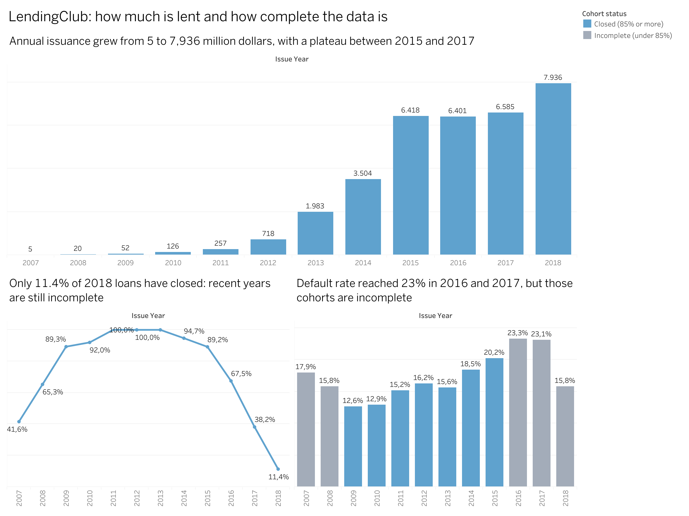
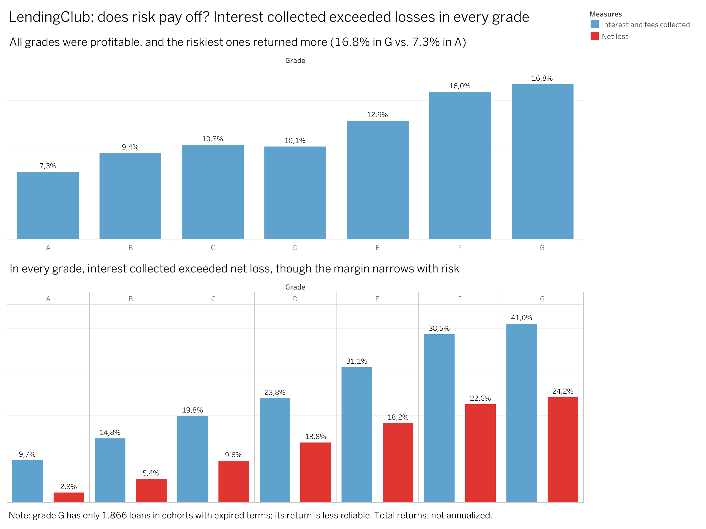
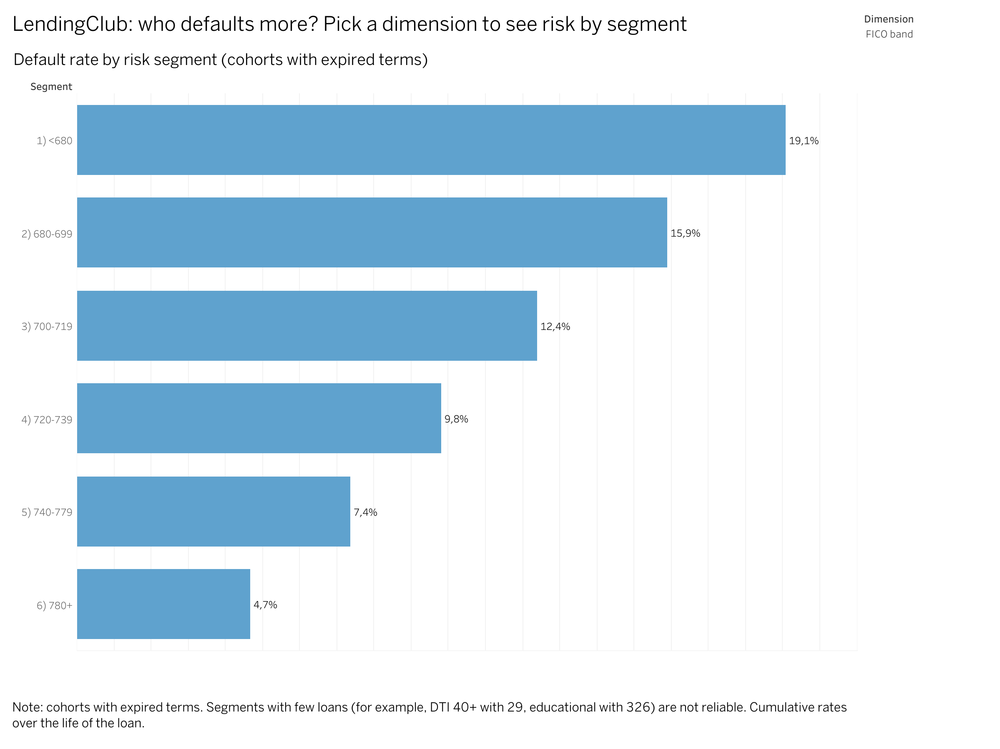

# LendingClub · Credit Risk & Collections Analysis

🌎 [Leer en español](README.es.md)

**Tools:** PostgreSQL · SQL · Python · Git & GitHub · Tableau Public
**Data:** [LendingClub accepted loans, 2007–2018 (Kaggle)](https://www.kaggle.com/datasets/wordsforthewise/lending-club) · 1,345,350 closed loans · US dollars

## 🎯 Key message

> **In every grade, LendingClub collected more interest than it lost. But the riskier the grade, the fewer times interest covers the loss (from 4.1 in grade A to about 1.7 in grades D to G), and when a loan fails only about 13% of the unpaid principal is recovered, whatever the grade.**

## 📊 Dashboard

👉 **[Open the interactive dashboard on Tableau Public](https://public.tableau.com/views/LendingClubCreditRiskCollectionsRiesgodecrditoycobranza/1Howmuchislent)** (3 pages in English and 3 in Spanish)





## ❓ Business questions

This is a simulated business case. I defined the questions myself, based on the available data:

1. How much is lent, and how is it evolving?
2. What share of loans is not repaid?
3. Which customer profiles and loan types are riskiest?
4. How much of the unpaid amount is recovered?

## 🔎 Key findings

- **Issuance grew from 5 to 7,936 million dollars** between 2007 and 2018, but recent years are incomplete: only 11.4% of the loans issued in 2018 have closed.
- **Risk grows faster than price.** From grade A to grade G, default rises about 6.8 times, while the interest rate rises about 3.4 times.
- **Every grade was profitable**, and the riskiest ones earned more, but with a thinner cushion.
- **Collections recover little**: about 13% of the unpaid principal, almost the same in every grade.
- **Customers with a lower FICO score or more debt relative to income default more.** Verified customers also default more, which most likely reflects who gets verified rather than an effect of verification.

The full analysis, with tables and every assumption, is in the executive summary: [English](docs/executive_summary_EN.md) · [Español](docs/resumen_ejecutivo_ES.md).

## ✅ Recommendations

Two ideas to **test**, not final conclusions:

1. **Evaluate whether the interest rate should take debt-to-income into account more**, or restrict, as an experiment, loans to customers with a DTI of 30% or more. Estimated impact: about 4.1 million dollars on historical cohorts.
2. **Test earlier collections, differentiated by segment**, in a pilot. Estimated impact: about 9.6 million dollars if recovery rose from 12.8% to 14%.

Estimates are cumulative, not annual, and do not subtract the cost of the actions.

## 🛠️ Process

| Phase | What I did |
|---|---|
| 0 | Set up the environment: Linux on Windows (WSL), Git, PostgreSQL and GitHub CLI |
| 1 | Downloaded and profiled the data, and chose which loans and columns to keep |
| 2 | Loaded into PostgreSQL as text, then cleaned and typed with SQL |
| 3 | Exploratory analysis with SQL |
| 4 | Risk, loss, recovery and return metrics; tables for Tableau |
| 5 | Built and published the dashboards in Tableau Public (English and Spanish) |
| 6 | Wrote the executive summary and recommendations |

Tableau Public does not connect to databases, so the flow is: **PostgreSQL → SQL queries → CSV files in `clean/` → Tableau Public**.

## 💡 Skills shown

- **SQL (PostgreSQL):** aggregations, `CASE`, views, `JOIN`, `UNION ALL`, `WITH`, date and type conversion.
- **Data cleaning and validation:** staging table, documented data-quality decisions, totals reconciled through two independent paths.
- **Credit risk metrics:** default rate, gross and net loss, recovery rate, return, cohort analysis.
- **Analytical judgment:** survivorship bias, confounding, correlation versus causation, small samples.
- **Tableau Public:** dashboards with filters, calculated fields and a bilingual version.
- **Git and GitHub from the command line.**
- **Communication:** an executive summary with a key message, recommendations with KPI and impact, and limitations.

## 🔁 How to reproduce

1. Download `accepted_2007_to_2018Q4.csv.gz` from Kaggle, unzip it and put it in `raw/` (not included here because of its size).
2. Run the scripts in `sql/` in this order:

| Script | Purpose |
|---|---|
| `00_make_subset.py` | Keeps closed loans and 29 columns: `clean/loans_subset.csv` |
| `01_create_staging.sql` | Creates the `loans_raw` table (all text) |
| *(load)* | `\copy loans_raw FROM 'clean/loans_subset.csv' WITH (FORMAT csv, HEADER true)` |
| `02_clean.sql` | Creates the typed `loans` table |
| `04_views.sql` | Creates the `loans_mature` view |
| `07_issued_by_year.py` | Counts all loans issued per year, from `raw/` |
| `08_create_issued_by_year.sql` | Creates `issued_by_year` (then load `clean/issued_by_year.csv` with `\copy`) |
| `06`, `09`, `10` `_export_*.sql` | Create the views that feed Tableau (export each with `\copy (...) TO ... CSV`) |

`03_eda.sql` and `05_risk_return.sql` hold the exploratory and risk-return queries. The Tableau workbook is in `tableau/`.

## ⚠️ Limitations

- Only approved loans are available; there are no rejected applications.
- Loans that are still current or late were excluded, and risk and return comparisons use only loans whose term has already ended. The cutoff (December 31, 2018) is my assumption.
- Returns are cumulative over the life of the loan, not annual, and they exclude operating costs.
- Correlation is not causation: the effects of DTI and term were not fully separated from the effect of the grade.
- Small groups, such as grade G (1,866 loans), are less reliable.

Every assumption, with its reason, is in the executive summary and in [`docs/data_quality_log.md`](docs/data_quality_log.md).

## 🤝 How I worked on this project

This project was also my way of learning finance and strengthening my SQL, Git and Tableau. I ran and validated every query, decided what to include and built the dashboards. To better understand what the tables and charts were showing, I relied on an AI (Claude), which helped me understand finance and banking concepts I did not know.

## 📁 Repository structure

```
sql/        SQL and Python scripts, in order
clean/      Clean data and the CSV files used by Tableau
docs/       Executive summary (ES/EN) and data-quality log
images/     Dashboard screenshots
tableau/    Tableau workbook (.twbx)
```

`raw/` (the original data) is not uploaded because of its size.
